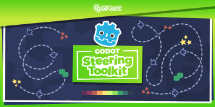

# Godot Steering AI Framework #

This project is a framework to code complex and smooth AI movement in GDScript, using steering behaviors. It works in both 2D and 3D games.

It supports all essential steering behaviors like flee, follow, look at, but also blended behaviors, group behaviors, avoiding neighbors, following a path, following the leader, and much more.

<!-- markdown-toc start - Don't edit this section. Run M-x markdown-toc-refresh-toc -->
**Table of Contents**
- [Introduction](#introduction)
- [The framework](#the-framework)
- [Installation](#installation)
- [Getting Started](#getting-started)
  - [More information and resources](#more-information-and-resources)
- [Example usage](#example-usage)
<!-- markdown-toc end -->

## Introduction ##

In the 1990s, [Craig Reynolds](http://www.red3d.com/cwr/) developed algorithms for common AI behaviors. They allowed AI agents to seek out or flee from a target, follow a pre-defined path, or face in a particular direction. They were simple, repeatable tasks that could be broken down into programming algorithms, which made them easy to reuse, maintain, combine, and extend.

While an AI agent's next action is based on decision making and planning algorithms, steering behaviors dictate how it will move from one frame to the next. They use available information and calculate where to move at that moment.

Joining these systems together can give sophisticated and graceful movement while also being more efficient than complex pathfinding algorithms like A\*.

## The framework ##

This project is a framework for the [Godot game engine](https://godotengine.org/). It takes inspiration from the excellent [GDX-AI](https://github.com/libgdx/gdx-ai) framework for the [LibGDX](https://libgdx.badlogicgames.com/) java-based framework. 

Every class in the framework extends Godot's [Reference](https://docs.godotengine.org/en/latest/classes/class_reference.html) type. There is no need to have a complex scene tree; you can contain that has to do with the AI's movement inside GDScript classes.

### How it works ###

In GSAI, a steering agent represents a character or a vehicle. The agent stores its position, orientation, maximum speeds, and current velocity. The agent stores a steering behavior that calculates a linear or angular change in velocity based on its information.

The coder then applies that acceleration in whatever ways is appropriate to the character to change its velocities, like RigidBody's `apply_impulse`, or a KinematicBody's `move_and_slide`.

## Documentation ##

The framework's documentation and code reference are both available on the [GDQuest](https://www.gdquest.com/docs/godot-steering-ai-framework/getting-started) website.

Here are some guides to get you started:

1. [How to install the framework](https://www.gdquest.com/docs/godot-steering-ai-framework/how-to-install/)
1. [Getting Started](https://www.gdquest.com/docs/godot-steering-ai-framework/getting-started/)
1. [Code reference](https://www.gdquest.com/docs/godot-steering-ai-framework/reference/)

## Contributing ##

If you encounter a bug or you have an idea to improve the tool, please [open an issue](https://github.com/GDQuest/gdscript-docs-maker/issues/new).

If you want to contribute to the project, for instance by fixing a bug or adding a feature, check out our:

1. [Contributor's guidelines](https://www.gdquest.com/docs/guidelines/contributing-to/gdquest-projects/).
1. [GDScript style guide](https://www.gdquest.com/docs/guidelines/best-practices/godot-gdscript/)

## Support us ##

Our work on Free Software is sponsored by our [Godot game creation courses](https://gdquest.mavenseed.com/). Consider getting one to support us!

*If you like our work, please star the repository! This helps more people find it.*

## Join the community ##

- You can join the GDQuest community and come chat with us on [Discord](https://discord.gg/CHYVgar)
- For quick news, follow us on [Twitter](https://twitter.com/nathangdquest)
- We release video tutorials and major updates on [YouTube](https://youtube.com/c/gdquest)
